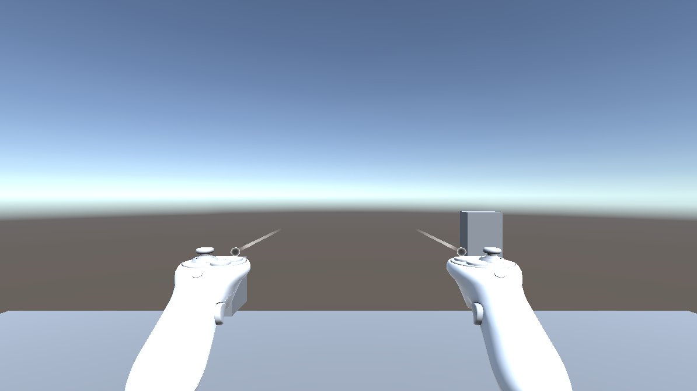

# Escape Room / Survival Horror Framework

## Documentació completa de la plantilla

Versió documentada: Unity 6.4 (`6000.4.9f1`)  
Pipeline: Universal Render Pipeline (URP) 17.4  
Input: Unity Input System 1.20  
VR: OpenXR 1.16, XR Plug-in Management 4.5 i XR Interaction Toolkit 3.3  
Interfície: UI Toolkit; no es necessita cap `Canvas` per al flux principal.

> Aquesta guia explica tant l'ús per a dissenyadors com l'arquitectura per a programadors. Les parts d'àudio, art i configuració gràfica final queden intencionadament obertes perquè l'autor del projecte les personalitzi.

---

## Índex

1. Què inclou la plantilla
2. Inici ràpid
3. Escenes i flux de joc
4. Menú principal i menú de pausa
5. Estructura de carpetes
6. Arquitectura global
7. Bootstrap i serveis persistents
8. Sistema d'entrada i controls
9. Jugador de PC
10. Interacció comuna PC/VR
11. Outline URP professional
12. Inventari i accés ràpid
13. Crear objectes d'inventari
14. Combinació, ús contextual i examen 3D
15. Objectes físics i equipament
16. Llanterna
17. Cordura i esdeveniments de terror
17bis. Referència dels altres mòduls de Survival Horror
18. Puzles
19. Pistes progressives
20. Objectius i final de partida
21. Guardat i càrrega
22. UI Toolkit
23. Preparació per a VR
24. Substitució segura de models
25. Menú superior `Escape Room Framework`
26. Escenes de demostració
27. Crear una sala des de zero
28. Ampliar la plantilla amb C#
29. Validació i publicació
30. Resolució de problemes
31. Referència ràpida d'API

---

## 1. Què inclou la plantilla

La plantilla és una base modular per construir jocs d'Escape Room i Survival Horror en primera persona, amb una mateixa lògica reutilitzable a PC i VR.

### Mecàniques d'Escape Room

- Interacció per raycast amb portes, calaixos, notes, objectes, palanques i interruptors.
- Inventari persistent amb piles, categories, accions contextuals i accés ràpid.
- Combinació guiada d'objectes.
- Examen 3D amb rotació i zoom.
- Lectura de documents i notes.
- Portes bloquejades i receptors d'objectes.
- Panells de codi numèric.
- Puzles de seqüència.
- Puzles d'estat, com una combinació de palanques.
- Puzles de socket lògic o físic.
- Puzles de col·locar peces (`PlacementPuzzle`), amb exclusivitat de socket i correcció parcial.
- Grups de puzles encadenats (`MultiStagePuzzle`): tots els fills visibles, final conjunt i ordre lliure o obligatori.
- Punts d'interès (hotspots) clicables a l'examen 3D, amb revelació d'informació/item persistent.
- Manipulació física, transport, rotació, llançament i encaix d'objectes.
- Pistes progressives associades al puzle actiu.
- Objectius amb prerequisits i final automàtic de sala.
- Finals de victòria o derrota configurables.
- Guardat de l'estat de puzles, portes, inventari, objectius i objectes recollits.

### Mecàniques de Survival Horror

- Llanterna equipable amb càrrega persistent.
- Consum de bateries des de l'inventari.
- HUD de bateria només quan la llanterna està equipada.
- Sistema de cordura amb quatre estats: estable, inquiet, angoixat i crític.
- Penalització de cordura en errors de puzle.
- Recuperació passiva configurable.
- Esdeveniments de terror condicionats per zona, cordura o activació manual.
- Esdeveniments persistents d'un sol ús o amb cooldown.
- Subtítols, so i `UnityEvent` per connectar animació, llums o altres efectes.
- Equipament visible a la mà i possibilitat de deixar-lo anar.
- Evasió avançada opcional: lean amb col·lisió de càmera, mirada enrere i slide amb postura segura.
- En VR, lean i mirada enrere físics; slide artificial de Quest desactivat per defecte.
- Director de tensió opcional: cooldown global, pressupost d'esdeveniments i zones segures per sobre dels triggers individuals.
- Camera shake i hàptics de tensió lligats a cordura crítica i persecució (el shake es desactiva sol en VR).
- Opcions d'accessibilitat reals: reducció de destellos, tremolor de càmera i sorolls forts, i assistència en persecucions.

### Sistemes transversals

- Menú principal, pausa, resultats, crèdits, ajustos i Save/Load amb UI Toolkit.
- Rebinding de teclat durant l'execució.
- Tres ranures manuals, guardat ràpid i càrrega ràpida.
- Escriptura JSON atòmica i miniatures.
- Arquitectura per esdeveniments i dades en `ScriptableObject`.
- Adaptadors de plataforma per evitar dependències directes de PC o d'un visor VR.
- Eines d'Editor per crear, preparar i validar contingut.

### Perfils de gènere: què s'activa i què s'amaga

La plantilla té un únic perfil actiu per projecte, desat a `Resources/GenreFeatureSettings.asset`. Es canvia des de `Escape Room Framework > Configuration` i s'aplica en iniciar la sessió de Play següent.

La base compartida no es pot desactivar mai, perquè és l'esquelet del joc:

| Sistema | Escape Room | Survival Horror | Custom Hybrid |
|---|---:|---:|---:|
| Interacció, inventari, examen, notes i objectes físics | Sí | Sí | Sí |
| Portes, codis, puzles, pistes, objectius, Save/Load i finals | Sí | Sí | Sí |
| PC, comandament, VR, menús i UI Toolkit | Sí | Sí | Sí |

La resta són **mòduls opcionals**. Cadascun correspon a un flag d'`OptionalGameFeature` i, amb el perfil `Custom Hybrid`, s'activa o es desactiva per separat des de l'Inspector de `GenreFeatureSettings`:

| Flag | Sistema | Escape Room | Survival Horror |
|---|---|---:|---:|
| `Flashlight` | Llanterna amb bateria i HUD (`F`/`R`) | Inactiu | Actiu |
| `Sanity` | Cordura, HUD d'estabilitat i penalització per errors de puzle | Inactiu | Actiu |
| `HorrorEvents` | Esdeveniments de terror i director de tensió | Inactiu | Actiu |
| `PlayerVitals` | Vida, dany, mort/respawn i estamina | Inactiu | Actiu |
| `EnemyAI` | Enemic amb patrulla, visió, oïda i persecució | Inactiu | Actiu |
| `Hiding` | Amagatalls amb risc d'exposició | Inactiu | Actiu |
| `NightVision` | Visió nocturna amb càrrega i zoom | Inactiu | Actiu |
| `Checkpoints` | Punts de control que restauren món i jugador | Inactiu | Actiu |
| `Traversal` | Saltar, esquivar i passar per forats | Inactiu | Actiu |
| `EvidenceRecording` | Gravar proves amb càmera (found-footage) | Inactiu | Actiu |
| `AdvancedEvasion` | Lean, mirada enrere i slide (`Alt + A/D`, `X`, `V`) | Inactiu | Actiu |
| `AdvancedDoors` | Portes que es poden aguantar, forçar o bloquejar | Inactiu | Actiu |

Consulta la secció 17bis per al funcionament i la configuració de cadascun.

Per crear un Escape Room pur:

1. Selecciona `Escape Room Framework > Configuration > Use Escape Room Profile`.
2. Inicia Play de nou. El HUD d'`ESTABILIDAD`, la bateria de la llanterna i els controls de llanterna no apareixeran.
3. Pots conservar els components de Survival Horror als prefabs i escenes: s'autodesactiven, de manera que no cal duplicar contingut.

Per crear un Survival Horror, selecciona `Use Survival Horror Profile`. S'activen conjuntament llanterna, cordura i esdeveniments de terror.

`Use Custom Hybrid Profile` permet seleccionar individualment `Flashlight`, `Sanity` i `Horror Events` a l'Inspector de `GenreFeatureSettings`. Això permet, per exemple, un Escape Room fosc amb llanterna però sense cordura. `Select Genre Feature Settings` localitza l'asset central.

La separació afecta runtime i interfície, no elimina assets. Així es pot canviar de gènere sense perdre configuració. Els sistemes compartits continuen disponibles als tres perfils.

---

## 2. Inici ràpid

### Provar la plantilla

1. Obre `Assets/_EscapeRoomTemplate/Scenes/MainMenu.unity` per provar el menú directament, o inicia una build per recórrer també `Intro`.
2. Prem Play.
3. Selecciona `Nueva partida`.
4. Es carregarà `ShowcaseMuseum`, la primera escena jugable configurada.
5. Mou-te amb WASD i mira amb el ratolí.
6. Mira un objecte interactuable i prem `E`.
7. Prem `I` per obrir l'inventari.
8. Prem `Esc` per obrir la pausa.

### Provar directament una escena jugable

També pots obrir `ShowcaseMuseum.unity` o `LockedOffice.unity` i prémer Play. El `GameManager` de l'escena crea o localitza els serveis necessaris. Una build comercial ha de començar per `Intro` si s'utilitza; en cas contrari, per `MainMenu`.

### Ordre actual del Build Profile

1. `Intro.unity`
2. `MainMenu.unity`
3. `ShowcaseMuseum.unity`
4. `LockedOffice.unity`
5. `SurvivalHorrorDemo.unity`
6. `VRTemplate.unity`
7. `ShowcaseMuseumVR.unity`
8. `LockedOfficeVR.unity`

`ShowcaseMuseumVR.unity` és la versió VR completa del museu i es distribueix com a escena de demostració específica de plataforma. `VRTemplate.unity`, en canvi, és només l'escena mínima amb rig, teleport, grab i interacció bàsica; no conté les sales del museu.

Si una escena es canvia de nom o de carpeta, cal actualitzar el Build Profile i `GameFlowSettings`.

---

## 3. Escenes i flux de joc

`GameFlowManager` és l'autoritat de navegació. És persistent entre escenes i manté un únic estat:

| Estat | Significat |
|---|---|
| `Boot` | Encara no s'ha inicialitzat el flux. |
| `MainMenu` | L'escena activa coincideix amb el menú configurat. |
| `Loading` | Hi ha una càrrega asíncrona en curs. |
| `Playing` | La partida està activa. |
| `Paused` | `Time.timeScale` és 0 i el menú de pausa és visible. |
| `Completed` | La partida ha acabat amb victòria. |
| `Failed` | La partida ha acabat amb derrota. |

La configuració es carrega de:

`Assets/_EscapeRoomTemplate/Resources/GameFlowSettings.asset`

Aquest asset defineix almenys:

- l'escena del menú principal;
- la primera escena jugable;
- la ranura preferida per a `Continuar`.

### Exemple de navegació des de codi

```csharp
using EscapeRoomRevolt.Core.Flow;

public void ComencarPartida()
{
    GameFlowManager.EnsureInstance().StartNewGame();
}

public void TornarAlMenu()
{
    GameFlowManager.EnsureInstance().ReturnToMainMenu();
}

public void ReiniciarEscena()
{
    GameFlowManager.EnsureInstance().RestartCurrentScene();
}
```

`EnsureInstance()` retorna el gestor existent o en crea un si la escena s'ha executat aïlladament. Això facilita provar escenes sense passar sempre pel menú.

---

## 4. Menú principal i menú de pausa

### Sí: existeix un menú principal real

L'escena és:

`Assets/_EscapeRoomTemplate/Scenes/MainMenu.unity`

Conté un `UIDocument` amb:

- `EscapeRoomMenu.uxml`: estructura visual;
- `EscapeRoomMenu.uss`: estil;
- `UIToolkitMenuController`: navegació i accions.

No és un simple panell dins de l'escena jugable: és una escena independent. És la primera escena de la build quan no hi ha intro, o la segona darrere de `Intro`.

### Opcions del menú principal

- `Continuar`: carrega la ranura preferida o la partida guardada més recent. Es desactiva si no hi ha cap partida.
- `Nueva partida`: reinicia l'estat temporal i carrega la primera escena jugable. No elimina les ranures existents.
- `Cargar partida`: mostra les tres ranures manuals.
- `Ajustes`: obre opcions i controls.
- `Créditos`: mostra el text de crèdits que el comprador ha de personalitzar.
- `Salir`: demana confirmació i tanca l'aplicació. A l'Editor atura Play Mode.

`Ajustes` inclou el selector d'idioma quan `DefaultLocalizationCatalog` té més d'una llengua. `UIToolkitMenuController` crea automàticament `SaveManager`, `GameSettingsService`, `LocalizationService` i `InputRouter` si el menú s'executa sense el `GameManager` persistent.

### Opcions del menú de pausa

- reprendre la partida;
- guardar;
- carregar;
- ajustos;
- tornar al menú principal;
- sortir del joc.

### Flux exacte per tornar al menú principal

1. Prem `Esc` durant una partida.
2. Prem `Menú principal…`.
3. Apareix una pantalla titulada `VOLVER AL MENÚ PRINCIPAL`.
4. Prem `VOLVER AL MENÚ`.
5. `GameFlowManager` restaura `Time.timeScale = 1` i carrega `MainMenu` asíncronament.

La confirmació evita perdre progrés per un clic accidental. `CANCELAR` retorna al menú de pausa.

### Si no es carrega

Comprova, en aquest ordre:

1. que has premut el segon botó de confirmació;
2. que `MainMenu.unity` està habilitada al Build Profile;
3. que `GameFlowSettings.MainMenuScene` és `MainMenu` o la seva ruta correcta;
4. que no hi ha un error a Console just després de confirmar;
5. que no s'ha iniciat una altra transició al mateix frame.

---

## 5. Estructura de carpetes

```text
Assets/_EscapeRoomTemplate/
├── Art/                         Materials i art temporal
├── Audio/                       Música, veus i passos de mostra
├── Core/
│   ├── Editor/                  Generadors, menú i validadors
│   └── Runtime/
│       ├── Flow/                Escenes, objectius i finals
│       ├── Input/               InputRouter
│       ├── Save/                SaveManager i ISaveable
│       └── Settings/            Ajustos persistents
├── Player/
│   ├── Common/                  Contractes compartits PC/VR
│   ├── PC/                      Moviment i adaptador desktop
│   └── VR/                      Adaptador, bridge XRI i UI 3D
├── Prefabs/                     GameManager, jugadors i equipament
├── Resources/                   Assets carregats per nom en runtime
├── Scenes/                      MainMenu i demos
├── ScriptableObjects/           Items, puzles, pistes i Survival
├── Settings/                    URP i RenderTexture d'examen
├── Systems/
│   ├── Equipment/
│   ├── Hint/
│   ├── Interaction/
│   ├── Inventory/
│   ├── Puzzle/
│   └── Survival/
└── UI/
    ├── PC/                      Façana/compatibilitat de UI
    └── Toolkit/                 UXML, USS i controladors
```

### Regla d'organització per a un joc comprador

No cal modificar el framework per crear contingut. És preferible crear una carpeta pròpia:

```text
Assets/MyGame/
├── Art/
├── Audio/
├── Prefabs/
├── Scenes/
├── ScriptableObjects/
│   ├── Items/
│   ├── Puzzles/
│   ├── Hints/
│   ├── Objectives/
│   └── Endings/
└── Scripts/
```

Això simplifica actualitzacions futures de l'asset.

---

## 6. Arquitectura global

```text
Input System
    ↓
InputRouter ───────────────┐
    ↓                      │
Jugador PC / Rig VR       │
    ↓                      │
InteractionDispatcher     │
    ↓                      │
IInteractable             │
    ├── portes             │
    ├── notes              │
    ├── objectes           │
    └── puzles             │
                           │
EventBus ←─────────────────┘
    ├── ObjectiveManager
    ├── HintManager
    ├── GameplayUIController
    └── lògica personalitzada

SaveManager ← ISaveable de cada sistema
GameFlowManager → escenes, pausa i finals
```

Principis aplicats:

- `ScriptableObject` per separar dades de lògica i de presentació.
- Interfaces per evitar dependències concretes.
- Esdeveniments C# i `EventBus` per comunicar sistemes desacoblats.
- `UnityEvent` per permetre connexions de dissenyador a l'Inspector.
- IDs persistents per desar dades sense dependre del nom visible.
- Una font única d'entrada: `InputRouter`.
- Una autoritat única de flux: `GameFlowManager`.
- Una autoritat única de persistència: `SaveManager`.

---

## 7. Bootstrap i serveis persistents

El prefab `GameManager.prefab` conté el `Bootstrapper`. Durant l'arrencada garanteix que existeixin els serveis globals necessaris, com:

- `GameFlowManager`;
- `SaveManager`;
- `GameSettingsService`;
- `InputRouter`;
- `SanityController`;
- `AudioManager`;
- `HintManager`.

Els serveis que han de sobreviure a canvis d'escena utilitzen `DontDestroyOnLoad` i protegeixen el singleton contra duplicats.

`GameContext` conserva l'estat general d'inicialització i neteja l'`EventBus` en una sessió nova. No és un contenidor de dependències extensiu: el codi actual utilitza registres o instàncies explícites per als sistemes principals.

### EventBus

Tots els esdeveniments són `struct`. Exemple d'escolta d'un puzle:

```csharp
using EscapeRoomRevolt.Core;
using UnityEngine;

public sealed class ObreCompartimentEnResoldre : MonoBehaviour
{
    private void OnEnable()
    {
        EventBus.Subscribe<OnPuzzleSolved>(QuanPuzleResol);
    }

    private void OnDisable()
    {
        EventBus.Unsubscribe<OnPuzzleSolved>(QuanPuzleResol);
    }

    private void QuanPuzleResol(OnPuzzleSolved evt)
    {
        if (evt.puzzleId != "electric_panel") return;
        Debug.Log("Obrir compartiment secret");
    }
}
```

Cal donar-se de baixa a `OnDisable` o `OnDestroy`. En cas contrari, un objecte destruït podria deixar una subscripció morta.

---

## 8. Sistema d'entrada i controls

L'asset d'accions és:

`Assets/_EscapeRoomTemplate/Resources/Input/EscapeRoomInputActions.inputactions`

`InputRouter` en crea una còpia de runtime. Això evita modificar l'asset original quan el jugador reasigna controls.

### Controls predeterminats de PC

| Acció | Tecla / ratolí |
|---|---|
| Moure | WASD |
| Mirar | moviment del ratolí |
| Interactuar | E |
| Córrer | Shift esquerre |
| Ajupir-se | Ctrl esquerre |
| Saltar | Espai |
| Pausa / tancar modal | Esc |
| Inventari | I |
| Accés ràpid | 1, 2, 3, 4 |
| Navegar accés ràpid | roda del ratolí |
| Llanterna | F |
| Recarregar llanterna | R |
| Deixar equipament | G |
| Llançar objecte físic | clic esquerre |
| Rotar objecte físic | mantenir clic dret + ratolí |
| Deixar objecte físic | Q |
| Convertir objecte físic en inventari | E mentre el sostens |
| Demanar pista | H |
| Guardat ràpid | F5 |
| Càrrega ràpida | F9 |

També hi ha bindings de gamepad i XR dins del mateix asset.

### Llegir input en una mecànica nova

```csharp
using EscapeRoomRevolt.Core.Input;
using UnityEngine;

public sealed class ExempleInput : MonoBehaviour
{
    private void Update()
    {
        InputRouter input = InputRouter.Instance;
        if (input == null) return;

        Vector2 moviment = input.Move;
        if (input.HintPressed)
            Debug.Log("El jugador ha demanat una pista");
    }
}
```

No utilitzis `Input.GetKeyDown` en mecàniques noves. Passar per `InputRouter` manté rebinding, gamepad i VR en una única ruta.

### Rebinding

El menú `Ajustes > Controles` localitza el binding de teclat i inicia `StartInteractiveRebind`. `Esc` cancel·la l'operació. Les sobreescriptures es guarden a `GameSettingsData.bindingOverridesJson`, separades de les partides.

Si `E` deixa de funcionar:

1. obre `Ajustes`;
2. mira el valor d'`Interactuar`;
3. prem `Restablecer controles` si no indica `E`;
4. comprova que no hi hagi un modal obert;
5. comprova la capa `Interactable` i el LayerMask del jugador.

---

## 9. Jugador de PC

El prefab és `Assets/_EscapeRoomTemplate/Prefabs/Player_PC.prefab`.

Components principals:

- `PlayerMovement`: moviment, gravetat, salt, ajupir-se i càmera.
- `PlayerInputHandler`: accions de UI, accés ràpid i interaccions auxiliars.
- `PCPlayerPlatformAdapter`: publica cap i mà dreta al registre comú.
- `InteractionManager`: raycast d'interacció.
- `PhysicsGrabber`: objectes físics.
- `EquipmentController`: objectes equipables.

La mecànica no consulta directament `Camera.main` quan necessita la posició del jugador. Utilitza:

```csharp
Transform cap = PlayerPlatformRegistry.Current?.Head;
Transform maDreta = PlayerPlatformRegistry.Current?.GetHand(PlayerHand.Right);
```

Aquesta abstracció permet que la mateixa porta, equipament o puzle funcioni amb el rig VR.

---

## 10. Interacció comuna PC/VR

### Contracte `IInteractable`

Un interactuable exposa:

- text del prompt;
- tipus de cursor;
- si es pot usar ara;
- `Interact()`;
- entrada i sortida de focus.

`InteractableBase` ja implementa el contracte, la persistència base, l'outline i la generació d'un `SaveId` per instància d'escena.

### Exemple d'interactuable propi

```csharp
using EscapeRoomRevolt.Systems.Interaction;
using UnityEngine;
using UnityEngine.Events;

public sealed class BotóSecret : InteractableBase
{
    [SerializeField] private UnityEvent _onPressed;
    private bool _pressed;

    public override string InteractionPrompt =>
        _pressed ? "Ja està activat" : "Prémer botó";

    protected override void OnInteract()
    {
        if (_pressed) return;
        _pressed = true;
        SetInteractable(false);
        _onPressed?.Invoke();
    }

    [System.Serializable]
    private sealed class State { public bool pressed; }

    public override string SaveData()
    {
        return JsonUtility.ToJson(new State { pressed = _pressed });
    }

    public override void LoadData(string json)
    {
        State state = JsonUtility.FromJson<State>(json);
        _pressed = state != null && state.pressed;
        SetInteractable(!_pressed);
    }
}
```

### Flux PC

1. `InteractionManager` llança un raycast des del centre de càmera.
2. Cerca `IInteractable` al pare del collider.
3. En canviar l'objectiu, activa/desactiva focus i actualitza HUD.
4. Quan `InputRouter.InteractPressed` és cert, crida `InteractionDispatcher`.
5. El dispatcher executa la interacció, publica `OnInteractionPerformed` i envia haptic si la plataforma ho suporta.

### Seguretat amb objectes destruïts

Una referència guardada com a interface no conserva automàticament el comportament especial de `UnityEngine.Object == null`. Per això existeix `InteractableUtility.IsAlive()`. Qualsevol consumidor nou ha d'utilitzar-la abans d'accedir a un interactuable que es pugui destruir o desactivar.

---

## 11. Outline URP professional

La solució escollida és una `ScriptableRendererFeature` compatible amb Render Graph:

- `SelectionOutlineTarget` marca temporalment els renderers enfocats amb el bit 30 de `renderingLayerMask`.
- `SelectionMaskOutlineFeature` dibuixa aquests renderers en una màscara.
- el shader de composició detecta la vora de la màscara i la barreja amb la imatge final.

### Avantatges

- no modifica materials compartits;
- funciona amb models formats per diversos renderers;
- el gruix és estable en pantalla;
- és compatible amb prefabs i substitució de models;
- separa la selecció de les GameObject Layers;
- una sola passada gestiona tots els materials dels objectes.

### Configuració

1. Obre el Renderer de l'URP actiu, per exemple `Default_Forward_Renderer.asset`.
2. Comprova que conté `SelectionMaskOutlineFeature`.
3. Ajusta `thickness`, `color` i `injectionPoint`.
4. Assegura't que l'objecte deriva d'`InteractableBase` o incorpora `SelectionOutlineTarget`.
5. Els renderers visuals han d'estar sota el mateix arrel interactuable.

### Si no es veu

- confirma que la càmera usa el Renderer on hi ha la feature;
- comprova que els dos shaders `Hidden/EscapeRoom/...` existeixen;
- comprova que el renderer visual està inclòs a `_renderers`;
- evita substituir tot el prefab: substitueix només els fills de `ModelSocket`;
- comprova que el raycast realment enfoca l'objecte.

---

## 12. Inventari i accés ràpid

`InventoryManager` separa dos conceptes:

1. **Emmagatzematge**: fins a 20 slots per defecte, amb piles i quantitats.
2. **Accés ràpid**: fins a 4 referències per defecte; no duplica ni mou l'objecte.

Un accés ràpid guarda l'`ItemId`. Si s'esgota l'última unitat, la referència ràpida es neteja automàticament.

### Flux recomanat per al jugador

1. Recull una evidència amb `E`.
2. Obre l'inventari amb `I`.
3. Selecciona l'objecte.
4. La interfície només mostra accions vàlides.
5. Pot usar/equipar, llegir, examinar, combinar, assignar a accés ràpid o deixar-lo.

### Accions principals

`InventoryPrimaryAction` pot ser:

- `Automatic`: tria llegir, equipar/sostenir, consumir o cap acció segons dades.
- `Read`: obre la nota.
- `EquipOrHold`: instancia el `WorldPrefab` i l'equipa o sosté.
- `Consume`: elimina una unitat.
- `None`: no ofereix acció principal.

### API bàsica

```csharp
InventoryManager inventory = InventoryManager.Instance;

inventory.AddItem(itemData, 2);
bool teClau = inventory.HasItem("master_key");
inventory.UseItem("batteries");
inventory.SetActiveQuickSlot(1);
InventoryItemData actiu = inventory.GetActiveItem();
```

No modifiquis directament `Slots`. Utilitza l'API perquè es publiquin esdeveniments, s'actualitzi el HUD i es mantinguin els accessos ràpids.

---

## 13. Crear objectes d'inventari

### Crear les dades

1. Clic dret al Project.
2. `Create > Escape Room Framework > Inventory > Item`.
3. Configura un `ItemId` estable i únic.
4. Escriu nom i descripció.
5. Assigna icona i `WorldPrefab`.
6. Defineix categoria i acció principal.
7. Configura piles, consum, examen, lectura i combinacions.
8. Afegeix l'asset al `DefaultItemCatalog` o a un catàleg assignat al teu `InventoryManager`.

### Què ha de contenir el World Prefab

Per a un objecte recollible simple:

- collider;
- `PickableItem` amb el mateix `InventoryItemData`;
- visual sota un fill reemplaçable;
- opcionalment `Rigidbody` i `PhysicsGrabbable`.

Per a equipament:

- `Rigidbody`;
- collider;
- `EquippableItem`;
- el comportament d'equip, com `FlashlightController`;
- `ModelSocket` i model visual.

### IDs

`ItemId` és la clau de guardat, receptacles, bateries, combinacions i accés ràpid. No el canviïs després de publicar una versió sense una migració.

---

## 14. Combinació, ús contextual i examen 3D

### Combinació

Cada `InventoryItemData` pot declarar receptes:

- objecte compatible;
- resultat;
- si es consumeix aquest objecte;
- si es consumeix l'altre.

Exemple: `clau_trencada + cinta -> clau_reparada`.

El jugador selecciona `COMBINAR` i després un candidat compatible. La UI filtra les opcions. També es pot combinar des de l'examinador amb l'objecte actiu.

### Ús contextual en portes i receptors

`IInventoryItemTarget` defineix tres polítiques:

| Política | Comportament |
|---|---|
| `SelectedOnly` | Només prova l'objecte actiu de l'accés ràpid. |
| `OfferCompatible` | Obre un selector amb els objectes compatibles. Recomanat. |
| `AutoUseSingle` | Si només hi ha un candidat, l'utilitza automàticament. Opció d'accessibilitat. |

Exemple de receptor personalitzat:

```csharp
using EscapeRoomRevolt.Systems.Inventory;
using UnityEngine;

public sealed class ReceptorFusible : MonoBehaviour, IInventoryItemTarget
{
    public ItemUsePolicy UsePolicy => ItemUsePolicy.OfferCompatible;
    public bool ConsumeItemOnUse => true;

    public bool AcceptsItem(InventoryItemData item)
    {
        return item != null && item.ItemId == "fuse_15a";
    }

    public bool TryUseItem(InventoryItemData item)
    {
        if (!AcceptsItem(item)) return false;
        ActivarElectricitat();
        return true;
    }

    private void ActivarElectricitat() { }
}
```

### Examen 3D

`GameplayUIController` crea una càmera i una escena visual d'examen en runtime:

- arrossegar: rotar;
- roda: zoom;
- `Esc`: tancar;
- `COMBINAR`: intenta una combinació guiada.

L'objecte necessita `WorldPrefab` i `CanExamine = true`. El model d'examen és una còpia visual; no modifica l'objecte real ni el prefab.

### Punts d'interès (hotspots) a l'examen 3D

Per amagar secrets dins un objecte examinat (una inscripció, un compartiment amagat, una pista), afegeix un fill al `WorldPrefab` amb un `Collider` i el component `ExamineHotspot`. Es crea des del menú: `Escape Room Framework > Create > Inventory > Examine Hotspot` (si tens un GameObject seleccionat, el crea com a fill seu).

Cada `ExamineHotspot` defineix:

- `id` (només ha de ser únic dins d'aquest objecte);
- text mostrat quan el jugador hi passa el cursor per sobre sense haver-lo trobat encara;
- text mostrat quan es revela (en clicar-hi);
- un `InventoryItemData` opcional que es concedeix la primera vegada;
- si només es pot revelar una vegada;
- un `UnityEvent` per a qualsevol efecte addicional (so, animació, partícules).

El jugador no necessita fer res especial: mentre examina l'objecte, passar el cursor per sobre del punt canvia el text de la descripció; en clicar-hi es revela. `ExamineHotspotRegistry` (instanciat automàticament pel `Bootstrapper`) recorda quins hotspots ja s'han trobat, així que en tornar a examinar el mateix objecte —fins i tot en una partida carregada— el text revelat apareix immediatament sense haver de tornar a clicar. Funciona igual a PC i a VR perquè reutilitza els mateixos events de punter que ja feien servir rotar i fer zoom.

---

## 15. Objectes físics i equipament

### Física

Un `PhysicsGrabbable` necessita `Rigidbody` i collider.

En PC:

- `E` sobre l'objecte: sostenir-lo;
- clic esquerre: llançar-lo;
- `Q`: deixar-lo;
- clic dret + ratolí: rotar-lo;
- `E` mentre el sostens i també té `PickableItem`: guardar-lo a l'inventari.

`PhysicsGrabber` restaura gravetat, damping, detecció de col·lisions i col·lisions amb el jugador en deixar-lo. També el deixa anar si s'allunya massa o s'obre una UI modal.

### Socket físic

`PhysicsSocket` és un trigger que:

1. espera que l'objecte compatible deixi d'estar sostingut;
2. compara l'`ItemId`;
3. desactiva física;
4. interpola fins al punt d'encaix;
5. llança `OnItemSnapped`;
6. opcionalment consumeix l'objecte i crea un resultat.

### Equipament

`EquipmentController` manté un únic objecte equipat. `EquippableItem` mou l'objecte al `EquipmentSocket`, desactiva colliders i notifica components `IEquipmentLifecycle`.

Quan es deixa anar amb `G`, es restaura al món amb física. Aquesta mateixa ruta serveix per a la llanterna i futurs objectes, com càmeres, detectors o armes defensives.

---

## 16. Llanterna

La llanterna modular és:

`Assets/_EscapeRoomTemplate/Prefabs/Survival/Flashlight_Modular.prefab`

### Ús del jugador

1. Equipa la llanterna interactuant-hi o usant-la des de l'inventari.
2. Prem `F` per encendre/apagar.
3. Prem `R` per consumir una unitat de l'item `batteries` i carregar-la al 100%.
4. Prem `G` per deixar-la al món.

Si no està equipada, `F` i `R` no fan res intencionadament.

### HUD

El HUD només apareix quan la llanterna està equipada. Mostra:

- percentatge;
- estat activa/en espera;
- estat de bateria baixa o crítica;
- recordatori de tecles.

### Configuració

`FlashlightController` permet ajustar:

- referència a `Light`;
- càrrega inicial;
- consum per segon;
- `ItemId` de bateria;
- si vol començar encesa quan s'equipa.

És `ISaveable`, per tant conserva càrrega i intenció d'encesa. `SaveId` actual: `Flashlight`. No hi ha d'haver dues llanternes persistents actives amb el mateix ID sense personalitzar el sistema.

---

## 17. Cordura i esdeveniments de terror

### SanityProfile

Defineix:

- valor màxim;
- recuperació passiva per segon;
- llindar `Uneasy`;
- llindar `Distressed`;
- llindar `Critical`.

Els llindars es normalitzen entre 0 i 1.

### API

```csharp
SanityController.Instance?.ApplyStress(12f);
SanityController.Instance?.Recover(8f);
SanityController.Instance?.SetNormalized(0.5f);
```

El HUD canvia text i classes USS quan canvia l'etapa. La plantilla no imposa efectes gràfics o d'àudio finals; el projecte pot escoltar `Changed` o `StageChanged` i aplicar postprocess, respiració o al·lucinacions pròpies.

### HorrorEvent

Un `HorrorEventDefinition` defineix:

- ID persistent;
- nom;
- subtítol;
- clip d'àudio;
- cordura màxima necessària per activar-se;
- estrès aplicat;
- si només passa una vegada;
- cooldown.

`HorrorEventTrigger` admet:

- entrada del jugador en un trigger;
- creuar un llindar de cordura;
- `TryTrigger()` manual.

Connecta `_onTriggered` a animacions, canvis de llum, aparicions o portes. El trigger desa si ja s'ha activat.

### Director de tensió (opcional)

Afegeix un `TensionDirector` a l'escena per limitar la freqüència *global* d'esdeveniments de terror, per sobre del cooldown propi de cada `HorrorEventTrigger`. Sense cap `TensionDirector` a l'escena, tot funciona exactament com abans —és un afegit purament opcional, mai obligatori.

Controla tres coses:

- **Cooldown global**: segons mínims entre qualsevol parell d'esdeveniments, encara que siguin triggers diferents.
- **Pressupost per finestra**: màxim N esdeveniments dins un període de temps mòbil, perquè no s'acumulin sustos seguits.
- **Zones segures**: un període de silenci garantit després de reaparèixer a un checkpoint. Qualsevol altre sistema pot allargar aquest silenci cridant `TensionDirector.Instance?.SuppressFor(segons)` —per exemple, `ChaseSafeZone` ja ho fa en travessar-la.

No cal connectar-lo a res manualment: `HorrorEventTrigger` ja el consulta sol si en troba un a l'escena.

### Camera shake i hàptics de tensió

`CameraShakeController` (instanciat automàticament pel `Bootstrapper` al jugador) ofereix un shake de càmera additiu, basat en "trauma" (0-1) que es va esvaint sol:

```csharp
CameraShakeController.Instance?.Shake(.5f);
```

Ja està connectat a la cordura crítica i a l'entrada en persecució d'un enemic, així que normalment no cal cridar-lo a mà —però qualsevol esdeveniment propi (un ensurt, una trampa) el pot fer servir igual. **Es desactiva sol en VR**: sacsejar la càmera d'un casc és una causa coneguda de mareig, a diferència d'un monitor.

Els mateixos dos punts (cordura crítica i persecució) també disparen un hàptic curt als dos mans del jugador VR via `PlayerPlatformRegistry.Current?.SendHaptic(...)`.

### Accessibilitat horror

`GameSettingsData` inclou aquestes opcions, totes disponibles al menú d'ajustos del joc:

| Opció | Efecte |
|---|---|
| `reduceFlashes` | Limita la intensitat de la vinyeta de `SanityFeedbackController`. |
| `reduceScreenShake` | Capa la intensitat del `CameraShakeController` a un valor baix configurable. |
| `reduceLoudSounds` | Redueix a la meitat el volum dels esdeveniments de terror i dels "tells" d'àudio de l'IA. |
| `chaseAssistance` | Alenteix un 15% la velocitat de persecució de l'enemic i n'escurça un 30% la memòria (independent de la dificultat). |
| `reduceGore` | Es desa i té toggle al menú, però la plantilla base no inclou contingut de gore —és un punt d'integració perquè el contingut que hi afegeixis el consulti. |

Cap d'aquestes opcions substitueix la dificultat: són ortogonals, pensades perquè un jugador pugui jugar en `Nightmare` i encara així activar `chaseAssistance` si li cal per motius d'accessibilitat.

---

## 17bis. Referència dels altres mòduls de Survival Horror

Les seccions 16 i 17 cobreixen llanterna, cordura i esdeveniments de terror. Aquesta cobreix la resta de mòduls opcionals de la taula de la secció 1. Tots s'activen o desactiven amb el seu flag a `GenreFeatureSettings`; si el flag està desactivat, el component s'autodesactiva i pots deixar-lo tranquil·lament a l'escena.

### Constants i salut del jugador (`PlayerVitals`)

Flag: `PlayerVitals`. Component al jugador. Gestiona vida i estamina en un sol lloc.

| Camp | Per a què serveix |
|---|---|
| `_maxHealth` | Vida màxima |
| `_damageInvulnerability` | Segons d'immunitat després de rebre un cop, per evitar morir per acumulació instantània |
| `_deathRespawnDelay` | Espera abans de reaparèixer |
| `_maxStamina` | Estamina màxima |
| `_sprintDrainPerSecond` | Consum mentre corres |
| `_recoveryPerSecond` / `_recoveryDelay` | Ritme i espera de recuperació |
| `_resumeSprintAt` | Fracció d'estamina necessària per tornar a poder córrer (evita l'esprint intermitent) |

Font de dany habitual: `DamageVolume` (zona que fa mal en entrar-hi o mentre hi ets).

### Enemic (`HorrorEnemyController` + `HorrorEnemyProfile`)

Flag: `EnemyAI`. El comportament viu al **perfil** (`ScriptableObject`), no al component: així pots tenir diversos enemics amb el mateix script i estadístiques diferents, o canviar la dificultat sense tocar l'escena.

Al component configures **on** i **què veu**:

| Camp | Per a què serveix |
|---|---|
| `_profile` | El `HorrorEnemyProfile` amb velocitats, rangs i temps |
| `_eye` | Des d'on calcula la visió (posa'l a l'alçada del cap) |
| `_patrolPoints` | Ruta de patrulla; si es deixa buit, es queda a la zona |
| `_visionBlockingMask` | Quines capes tallen la línia de visió |
| `_traversalDetectionDistance` / `_traversalDetectionRadius` | Com detecta obstacles que pot travessar |

Sistemes que hi interactuen:

- `PlayerVisibility` + `VisibilityZone` — com de visible ets segons on ets i què fas (agachat, amb llanterna encesa, en una zona fosca).
- `GameplayNoiseEmitter` — el que fa soroll et delata. `GameplayImpactNoiseEmitter` ho aplica als objectes llançats.
- `ChaseDirector` + `ChaseSafeZone` — controlen el **ritme** de la persecució i defineixen llocs on l'enemic abandona.

### Amagatalls (`HidingSpot`)

Flag: `Hiding`. Posa'l a un armari, sota un llit, etc.

| Camp | Per a què serveix |
|---|---|
| `_insideAnchor` / `_exitAnchor` | On es col·loca el jugador a dins i on surt |
| `_inspectionAnchor` | Des d'on mira l'enemic si ve a inspeccionar |
| `_kind` | Tipus (armari, sota el llit…) — afecta l'animació i la postura |
| `_forceCrouchedPose` | Força postura ajupida |
| `_minimumStayTime` | Evita entrar i sortir en un frame |
| `_exposureDamage` | Dany si et descobreixen a dins |
| `_calmBreathingIntensity` | Intensitat de la respiració (feedback de tensió) |

### Visió nocturna (`NightVisionController`)

Flag: `NightVision`. Model de recurs consumible, igual que la llanterna.

| Camp | Per a què serveix |
|---|---|
| `_maxCharge` / `_startingCharge01` | Càrrega màxima i inicial |
| `_drainPerSecond` | Consum mentre està encesa |
| `_batteryItemId` | `ItemId` de la recàrrega (per defecte `camcorder_battery`) |
| `_lowThreshold` / `_criticalThreshold` | Llindars d'avís del HUD |
| `_zoomFieldOfView` | FOV en fer zoom |

### Punts de control (`CheckpointManager` + `CheckpointEntity`)

Flag: `Checkpoints`. `SurvivalCheckpoint` marca el lloc; `CheckpointEntity` marca els objectes que s'han de restaurar. Els `PickableItem` s'hi afegeixen sols quan el flag està actiu.

Diferència important respecte al Save/Load: el checkpoint és **automàtic i de sessió** (tornar enrere en morir); el Save/Load és **explícit i persistent** (secció 21). Conviuen sense trepitjar-se.

### Travessies (`TraversalObstacle`)

Flag: `Traversal`. Saltar una tanca, passar per un forat, esquivar.

| Camp | Per a què serveix |
|---|---|
| `_type` | `Vault`, etc. |
| `_entryAnchor` / `_exitAnchor` | Punts d'entrada i sortida del moviment |
| `_duration` / `_arcHeight` / `_motionCurve` | Forma i durada del moviment |
| `_prompt` | Text d'interacció |
| `_enemyPolicy` | **Clau per al disseny**: si l'enemic pot seguir-te (`RouteAround` el fa donar la volta) |
| `_onStarted` / `_onCompleted` | `UnityEvent` per encadenar so o animació |

`_enemyPolicy` és el camp que converteix una travessia en una eina d'escapada: una finestra que l'enemic ha de vorejar et dona avantatge.

### Gravació de proves (`CamcorderEvidenceRecorder`)

Flag: `EvidenceRecording`. Mecànica found-footage: apuntar amb la càmera a una prova el temps suficient.

| Camp | Per a què serveix |
|---|---|
| `_viewCamera` | Càmera que grava |
| `_recordingMask` | Capes que es poden gravar |
| `_rayDistance` | Abast |
| `_resetProgressWhenReleased` | Si el progrés es perd en deixar de gravar |
| `_onRecordingStarted` / `_onRecordingStopped` / `_onEvidenceCompleted` | Enganxa-hi so, HUD o objectius |

Dades relacionades: `EvidenceDefinition` (què és cada prova), `RecordableEvidence` (component a l'objecte gravable) i `EvidenceJournal` (registre del que has recollit).

### Evasió avançada (`EvasionController`)

Flag: `AdvancedEvasion`. Lean amb col·lisió de càmera (`Alt + A/D`), mirada enrere (`X`) i slide (`V`).

En VR el lean i la mirada enrere passen a ser **físics** —mous el cos de veritat— i el slide artificial ve desactivat per defecte per confort.

### Consola d'energia (`SurvivalPowerConsole`)

Objectiu de sala típic: restablir el corrent per obrir una porta, fent soroll que atrau l'enemic.

| Camp | Per a què serveix |
|---|---|
| `_controlledDoor` | Porta que es desbloqueja |
| `_readyPrompt` / `_completedPrompt` | Textos abans i després |
| `_noiseRadius` | Radi del soroll generat: el preu de resoldre-ho |

### Dificultat (`SurvivalDifficultyService` + `SurvivalDifficultyProfile`)

Escala els paràmetres dels sistemes anteriors sense duplicar contingut. És **ortogonal a l'accessibilitat**: un jugador pot jugar en `Nightmare` i tenir igualment activada l'assistència en persecucions.

---

## 18. Puzles

### Separació dades/lògica

`PuzzleDefinition` conté dades reutilitzables:

- ID persistent;
- nom;
- categoria;
- objectiu textual;
- pistes;
- penalització de cordura per error.

`PuzzleController` conté estat runtime:

- `Unsolved`;
- `InProgress`;
- `Solved`.

També publica esdeveniments, desa l'estat i permet connectar `OnSolved` i `OnFailed` a l'Inspector.

### Panell de codi

`CodePanelPuzzle` admet:

- codi correcte;
- longitud màxima;
- comprovació automàtica;
- display TMP 3D;
- LED d'estat;
- sons de tecla, èxit i error.

Els botons 3D poden cridar `InputDigit("7")`; la UI Toolkit usa la mateixa API.

### Seqüència

`SequencePuzzle` rep IDs amb:

```csharp
sequencePuzzle.InputStep("red");
sequencePuzzle.InputStep("blue");
sequencePuzzle.InputStep("green");
```

Qualsevol desviació reinicia la seqüència i aplica el flux d'error.

### Estat

`StatePuzzle` observa diversos `SteppedPositioner`. Es resol quan tots estan a l'índex de posició requerit. L'ordre no importa.

`SteppedPositioner` mou un objecte entre N posicions discretes (rotació o translació), definides una a una des de l'Inspector: no està limitat a dos estats. No és interactuable per si sol — qui l'acciona es defineix a part, de manera que es pot reutilitzar en objectes que ja tenen el seu propi interactuable:

- `InteractableCycler` (menú `Create > Interactables > Multi-Position Lever`): fa que el jugador l'avanci una posició per clic. És la versió multi-posició d'`InteractableToggle`, que es manté binari per a interruptors simples.
- Un pont propi d'un puzle, com `PipeTileButton`, que ja és qui gestiona el clic i només fa servir el positioner per animar la rotació de la peça.

### Socket

`SocketPuzzle` compara un `ItemId`, pot consumir-lo i crear un model col·locat. Per a un flux d'inventari més intuïtiu, una porta o `ItemReceiver` amb `OfferCompatible` acostuma a ser preferible. Per a interacció física, utilitza `PhysicsSocket`.

### Col·locació de peces

`PlacementPuzzle` (menú `Create > Puzzles > Placement Puzzle`) resol un puzle de "col·loca cada peça al seu lloc": cada peça ha d'acabar al seu socket correcte, en qualsevol ordre.

```csharp
placementPuzzle.Connect("piece_a", "socket_a");
placementPuzzle.Disconnect("piece_a");
```

Un socket només pot tenir una peça alhora: col·locar-n'hi una altra en treu automàticament la que hi hagués, com un encaix real. Es comprova sol quan totes les peces tenen alguna col·locació (o crida `SubmitConnections()` manualment). A diferència del panell de codi, una col·locació incorrecta **no esborra res** —les que ja estaven bé es mantenen, així el jugador només corregeix les que fallen. Qui representa físicament cada peça/socket a l'escena (un objecte agafable, un botó, el que sigui) és cosa teva; el puzle només necessita que li cridis `Connect`/`Disconnect` amb els IDs corresponents.

### Puzles encadenats

`MultiStagePuzzle` (menú `Create > Puzzles > Multi-Stage Puzzle`) és un coordinador d'un nombre arbitrari de `PuzzleController` independents. Cada entrada `ChainedPuzzle` conté un `id`, el puzle fill i l'arrel que agrupa els seus controls. Tots els fills continuen actius i visibles a l'escena; no s'amaguen ni se substitueixen quan un altre es resol.

- `_requireOrder = false`: els fills es poden resoldre en qualsevol ordre.
- `_requireOrder = true`: s'ha de seguir l'ordre de la llista.
- `_lockFuturePuzzles = true`: els puzles futurs continuen visibles, però els seus `InteractableBase` no responen fins que arriba el seu torn.

La porta, llum o mecanisme final s'ha de connectar una sola vegada a l'`OnSolved` del coordinador. El coordinador només es resol quan tots els fills referenciats estan resolts. La llista de l'Inspector es pot ampliar amb tants puzles com necessiti l'habitació.

```csharp
int total = multiStagePuzzle.PuzzleCount;
int current = multiStagePuzzle.CurrentPuzzleIndex;
ChainedPuzzle entry = multiStagePuzzle.GetPuzzle(current);
```

El preset crea dos exemples físicament separats —seqüència a l'esquerra i palanques a la dreta— i configura ordre obligatori. És la mateixa estructura usada a la sala 11 de `ShowcaseMuseum` i `ShowcaseMuseumVR`.

### Rodets numèrics

`Number Wheels Puzzle` obre un configurador de creació: es poden triar entre 2 i 8 rodets decimals i introduir la combinació inicial xifra per xifra. El generador adapta automàticament el nombre de condicions de `StatePuzzle`, l'amplada de la carcassa, la separació, el títol (`CODI DE N XIFRES`), el botó d'entrada i el camp de visió de la càmera. No introdueix un solver redundant: cada rodet és un `SteppedPositioner`, `NumberWheelView` només en mostra la xifra i `StatePuzzle` comprova la combinació.

El component `NumberWheelsPuzzleAuthoring` conserva el nombre de rodes i la solució. Des del seu Inspector es poden editar i prémer `Rebuild wheels and layout`. La reconstrucció substitueix només `NumberWheels_Generated`: manté el mateix `StatePuzzle`, `PuzzleFocusPoint`, `PuzzleDefinition`, pistes i listeners `OnSolved`; també conserva els prefabs assignats als `ReplaceableModelSlot` de la carcassa, el botó i les rodes que continuen existint. Això permet tancar primer l'estructura del codi i substituir després els placeholders per una maleta, caixa forta o candau.

En PC cal obrir la vista enfocada i clicar els botons físics ▲/▼ situats damunt i sota de cada rodet; les dues direccions fan volta entre 0 i 9. `E` obre el panell i continua sent una alternativa sobre un control seleccionat, però no és necessària per prémer les fletxes. No hi ha control amb W/S ni amb les fletxes del teclat.

En PC, `Examinar combinació` activa `PuzzleFocusPoint` i obre una vista centrada amb una càmera pròpia; es mostren les peces 3D reals i se'n surt amb clic dret. `InteractionManager` llegeix la posició i el clic esquerre des del nou Input System mentre el cursor és lliure. En VR no es força cap càmera per evitar canvis de vista incòmodes: el panell VR genera controls ▲/▼ equivalents i tots dos camins criden `NumberWheelInteractable.TryStep`. El preset de la sala 13 col·loca el conjunt al 48% de l'escala original, a la paret al costat de la porta, mentre la càmera filla conserva una lectura gran en primer pla. Tant la carcassa (`CombinationLockHousing_Logic`) com cadascun dels quatre rodets tenen un `ReplaceableModelSlot`: es poden substituir per una maleta, una caixa forta o un candau mantenint intactes els controls, la combinació i la vista enfocada.

### Perills mòbils i temporitzador de Game Over

Són dues mecàniques independents. `MovingHazard` mou el seu objecte entre `Start Point` i `End Point`, de manera que la direcció pot ser qualsevol vector 3D. Serveix per una paret que avança o retrocedeix, un sostre que baixa, un terra que puja, una plataforma lateral o un volum d'aigua. Pot provocar derrota en arribar al destí i/o en tocar el jugador, exposa `StartHazard`, `StopHazard`, `ResetHazard` i `TriggerGameOver`, i desa el progrés del recorregut.

`GameOverTimer` no mou cap objecte. Gestiona un límit de temps independent, opcional i desable; si arriba a zero activa la derrota configurada. Pot mostrar-se al HUD compartit amb etiqueta, valor `mm:ss`, barra de progrés i avisos visuals als últims segons. Exposa `StartTimer`, `StopTimer`, `ResetTimer` i `Expire`, i desa el temps consumit i l'estat. Això permet usar només el temporitzador, només el perill mòbil o combinar-los mitjançant events sense acoblar-los.

`TimedGameOverHazard` es conserva únicament perquè escenes o prefabs antics continuïn carregant-se, però ja no apareix al menú normal d'autoria i no s'ha d'usar en contingut nou.

### Llançament

`ThrowPuzzle` registra dianes per ID. Cada `ThrowTarget` notifica l'impacte i el puzle es resol quan s'han completat totes les dianes requerides. El creador genera tres dianes funcionals.

### Lliscant

`SlidingPuzzle` manté una graella amb un únic forat i només accepta moviments adjacents. El remenat parteix de la solució amb moviments legals, de manera que la variant sempre és resoluble. `SlidingBoardView` crea les fitxes i pot repartir una imatge font entre les cel·les.

### Melodia

La melodia no necessita un solver nou: `MelodyPlayer` presenta la pista i els botons alimenten un `SequencePuzzle`. Això manté separats contingut audiovisual i regla d'ordre.

### Canonades

`PipePuzzle` rota segments 90° i valida amb cerca de camí que les obertures coincideixin des de la font fins al destí. El creador genèric aporta dades mínimes; en un nivell nou cal crear o reconstruir la vista interactiva i connectar un feedback a `OnSolved`. La sala 10 de `ShowcaseMuseum` ja és un exemple tancat: en resoldre, desbloqueja i obre `PipeExitDoor_Logic` i activa `PipeSolvedBeacon`.

### Puzle personalitzat

```csharp
using EscapeRoomRevolt.Systems.Puzzle;

public sealed class PuzlePes : PuzzleController
{
    public void ActualitzarPes(float pes)
    {
        SetInProgress();
        if (pes >= 9.5f && pes <= 10.5f)
            Solve();
        else if (pes > 15f)
            Fail("Massa pes");
    }
}
```

`Solve`, `Fail` i `SetInProgress` ja gestionen persistència indirecta, EventBus, pistes, cordura i UnityEvents.

---

## 19. Pistes progressives

Cada `PuzzleDefinition` pot apuntar a un `HintData`.

Quan el puzle entra en progrés:

- es registra com a puzle actiu;
- `H` demana la següent pista;
- les pistes poden progressar de subtils a explícites;
- en resoldre el puzle es neteja el context actiu.

`HintZoneTrigger` permet activar pistes en entrar en una zona. És útil quan un puzle no s'inicia amb una interacció directa.

Recomanació de disseny:

1. pista 1: recorda l'element rellevant;
2. pista 2: relaciona dos elements;
3. pista 3: explica l'operació;
4. evita donar directament la solució fins a l'últim nivell.

---

## 20. Objectius i final de partida

### ObjectiveDefinition

Cada objectiu defineix:

- ID;
- títol i descripció;
- visibilitat;
- trigger;
- ID de l'element esperat;
- prerequisits.

Triggers disponibles:

- manual;
- puzle resolt;
- item recollit;
- nota llegida;
- interacció realitzada.

### ObjectiveSet

Agrupa els objectius d'una sala i un `EndingDefinition` de finalització.

### ObjectiveManager

Escolta l'EventBus i completa automàticament objectius. Quan tots estan complets:

1. publica `OnRoomEscaped`;
2. calcula el temps;
3. crida `CompleteGame`;
4. la UI mostra la pantalla de resultats.

Per completar un objectiu des de codi:

```csharp
ObjectiveManager.Instance?.CompleteObjective("restore_power");
```

### Final directe

`GameEndTrigger` pot activar-se per `UnityEvent`, per codi o quan el jugador entra al trigger.

```csharp
using EscapeRoomRevolt.Core.Flow;

public void MonstreAtrapaJugador(EndingDefinition derrota)
{
    GameFlowManager.EnsureInstance().FailGame(derrota);
}
```

La pantalla final ofereix reintentar, menú principal o sortir.

---

## 21. Guardat i càrrega

### Funcionalitats

- tres ranures manuals: `slot_1`, `slot_2`, `slot_3`;
- ranura ràpida interna `slot_0`;
- metadades d'escena, data, temps jugat i miniatura;
- JSON versionat;
- escriptura temporal i substitució final;
- restauració després de carregar l'escena adequada;
- registre d'entitats destruïdes o recollides;
- protecció contra `SaveId` duplicats;
- neteja de referències Unity destruïdes.

Els fitxers es desen sota:

`Application.persistentDataPath/SaveSlots`

La ubicació física depèn del sistema operatiu i del `Company Name`/`Product Name` del projecte.

### Contracte ISaveable

```csharp
public interface ISaveable
{
    string SaveId { get; }
    string SaveData();
    void LoadData(string json);
}
```

### Exemple complet

```csharp
using EscapeRoomRevolt.Core.Save;
using UnityEngine;

public sealed class GeneradorPersistent : MonoBehaviour, ISaveable
{
    [SerializeField] private string _saveId = "generator_room_a";
    [SerializeField] private GameObject _poweredVisual;
    private bool _powered;

    [System.Serializable]
    private sealed class State
    {
        public int version = 1;
        public bool powered;
    }

    public string SaveId => _saveId;

    private void Start()
    {
        SaveManager.Instance?.Register(this);
        ApplyVisual();
    }

    private void OnDestroy()
    {
        SaveManager.Instance?.Unregister(this);
    }

    public void Activate()
    {
        _powered = true;
        ApplyVisual();
    }

    public string SaveData()
    {
        return JsonUtility.ToJson(new State { powered = _powered });
    }

    public void LoadData(string json)
    {
        State state = JsonUtility.FromJson<State>(json);
        if (state == null) return;
        _powered = state.powered;
        ApplyVisual();
    }

    private void ApplyVisual()
    {
        if (_poweredVisual != null)
            _poweredVisual.SetActive(_powered);
    }
}
```

### Regles crítiques

- `SaveId` ha de ser únic dins de l'escena restaurada.
- No utilitzis un nom que pugui canviar com a ID publicat.
- Registra a `Awake` o `Start` i desregistra a `OnDestroy`.
- `LoadData` ha d'aplicar l'estat visual immediatament, sense reproduir recompenses o sons d'èxit.
- Inclou una versió dins de dades pròpies si preveus canvis d'esquema.
- Executa `Validation > Validate Save IDs` abans de publicar.

### Objectes recollits

`PickableItem` crida `MarkAsDestroyed(SaveId)` després d'afegir-se a l'inventari. En carregar, `SaveManager` elimina l'objecte mundial i evita que reaparegui.

---

## 22. UI Toolkit

### Assets principals

- `EscapeRoomMenu.uxml`: menú principal, pausa, ajustos, slots i resultats.
- `EscapeRoomMenu.uss`: tema visual dels menús.
- `GameplayHUD.uxml`: HUD, inventari, notes, keypad i examinador.
- `GameplayHUD.uss`: estil de gameplay.
- `EscapeRoomPanelSettings.asset`: configuració compartida de panell.

### Controladors

`UIToolkitMenuController` construeix dinàmicament les pantalles de menú a `screen-content`.

`GameplayUIController` controla:

- crosshair;
- prompt d'interacció;
- hotbar;
- inventari;
- selector d'objecte compatible;
- notes;
- keypad;
- examen 3D;
- subtítols;
- HUD de llanterna;
- HUD de cordura.

### Bloqueig de gameplay

Quan hi ha una modal oberta:

- s'allibera el cursor;
- es bloqueja moviment/interacció segons el controlador;
- `Esc` tanca la modal superior abans d'obrir pausa;
- els objectes físics sostinguts es deixen anar.

### Personalitzar el disseny dels menús

Hi ha **tres nivells**, de menys a més invasiu. Fes servir sempre el més baix que et resolgui el problema.

#### Nivell 1 — `MenuThemeSettings` (recomanat: sense tocar codi ni USS)

Un `ScriptableObject` que reskineja el menú des de l'Inspector. És la via recomanada per canviar la marca del joc.

1. Botó dret al Project: `Create > Escape Room Framework > Menu Theme Settings`.
2. Selecciona el `GameObject` que té `UIToolkitMenuController` (a l'escena `MainMenu`).
3. Arrossega l'asset al camp **`_theme`**.

Camps disponibles:

| Camp | Efecte |
|---|---|
| `panelBackground` | Fons del panell del menú |
| `accent` | Vora del panell i color d'accent de targetes i camps de reassignació de tecles |
| `titleText` | Color del títol de cada pantalla |
| `buttonBackground` | Fons dels botons |
| `buttonBackgroundHover` | Fons dels botons amb el ratolí a sobre |
| `buttonText` | Color del text dels botons |
| `titleFont` | Tipografia dels títols (buit = per defecte d'Unity) |
| `bodyFont` | Tipografia de la resta de textos (buit = per defecte) |
| `logo` | `Sprite` que apareix sobre el títol a totes les pantalles (buit = cap logo) |

Dues coses a tenir en compte:

- Els valors per defecte de l'asset **coincideixen exactament** amb l'aspecte original. Crear-lo i no tocar res no canvia res.
- Deixar `_theme` buit també és vàlid: llavors manen els valors de `EscapeRoomMenu.uss`.
- **L'alt contrast sempre guanya.** Si el jugador activa alt contrast als ajustos d'accessibilitat, el tema s'ignora. És deliberat: l'accessibilitat passa per davant de la marca.

#### Nivell 2 — USS (colors, marges i estats que el tema no cobreix)

Edita `UI/Toolkit/EscapeRoomMenu.uss` (menús) o `UI/Toolkit/GameplayHUD.uss` (HUD de joc). Canviar **classes** és segur:

```css
.menu-button {
    background-color: rgb(28, 31, 34);
    color: rgb(225, 225, 215);
    border-left-color: rgb(120, 20, 20);
}

.menu-button:hover {
    background-color: rgb(45, 48, 52);
}
```

Compte amb l'ordre de prioritat: si tens un `MenuThemeSettings` assignat, els seus colors s'apliquen **per estil inline** i, per tant, **sobreescriuen l'USS** dels camps que cobreix. Si canvies un color a l'USS i no veus l'efecte, mira si el tema ja el controla.

#### Nivell 3 — UXML (estructura)

Edita `UI/Toolkit/EscapeRoomMenu.uxml` per afegir o reorganitzar elements.

**Regla crítica:** no canviïs els atributs `name` dels elements existents. Els controladors els busquen amb `Q<T>("nom")`, i renombrar-ne un el trenca en silenci (no dona error de compilació, simplement deixa de funcionar). Afegir elements nous amb noms nous és segur.

Noms que **no** es poden tocar sense actualitzar el C#: `screen-content`, `inventory-grid`, i qualsevol altre referenciat a `UIToolkitMenuController` o `GameplayUIController`.

---

## 23. Preparació per a VR

La plantilla inclou una base OpenXR funcional i independent del fabricant. Està configurada per a `Standalone` i `Android`, utilitza XRI 3.3 i manté la lògica d'Escape Room/Survival Horror compartida amb PC. La validació amb el visor final continua sent obligatòria abans de publicar un joc.



### Inici ràpid

1. Obre `Assets/_EscapeRoomTemplate/Scenes/VRTemplate.unity`.
2. Connecta el visor i confirma que el runtime OpenXR del sistema és l'actiu.
3. Entra en Play. El rig ja conté càmera, controladors, mans visuals, haptics, interactors i locomoció.
4. Sense visor, activa temporalment `XR Interaction Simulator (enable for editor testing)` i utilitza els controls del simulador oficial d'XRI.
5. Per convertir una escena pròpia, elimina `Player_PC`, col·loca `Player_VR.prefab` i executa `Escape Room Framework > Setup > Prepare Current Scene Interactables for VR`.
6. Revisa `Project Settings > XR Plug-in Management > Project Validation` per a la plataforma de build.

No mantinguis `Player_PC` i `Player_VR` actius alhora: tots dos registren el jugador, l'equipament i l'entrada global.

### Generació i reparació automàtica

`Escape Room Framework > Setup > Build Complete VR Template`:

- assigna `OpenXRLoader` a Standalone i Android;
- crea la configuració XR persistent sota `Assets/XR`;
- reconstrueix `Player_VR.prefab` a partir del rig oficial dels Starter Assets;
- crea `VRComfortSettings.asset`;
- crea o actualitza `VRTemplate.unity` i l'afegeix al Build Profile;
- inclou dos objectes de prova: grab físic i interacció simple.

Les ordres individuals `Configure OpenXR (PC + Android)`, `Create or Update VR Player Prefab` i `Create VR Template Scene` permeten regenerar només una part.

### Contingut de Player_VR

- `XROrigin`, `CharacterController` i càmera amb tracking;
- controladors esquerre i dret amb poke, near/far i teleport ray;
- visuals de mans/controladors i feedback hàptic;
- moviment continu i teleport;
- gir snap i continu;
- providers de climb, gravity i jump aportats pels Starter Assets;
- `VRPlayerPlatformAdapter`, equipament compartit i input global;
- un `ModelSocket` sota cada controlador;
- presentador world-space per a UI Toolkit.

Per substituir les mans o afegir un objecte visual, fes-lo fill del `ModelSocket` corresponent. No eliminis el controlador, els interactors ni el socket.

### Confort i locomoció

`Assets/_EscapeRoomTemplate/Resources/VRComfortSettings.asset` exposa:

- `locomotionMode`: només teleport, només moviment continu o tots dos;
- `continuousMoveSpeed`: velocitat de desplaçament;
- `turnMode`: gir snap o continu;
- `snapTurnAmount`: graus per gir;
- `continuousTurnSpeed`: velocitat angular.

`VRComfortController` aplica el perfil als providers XRI. També és la ruta comuna perquè amagatalls, pausa o respawn bloquegin/restaurin la locomoció sense dependre de `PlayerMovement`.

Si el sample "Tunneling Vignette" d'XRI Starter Assets està importat, `Setup > Create or Update VR Player Prefab` l'instal·la automàticament davant la càmera i el connecta al moviment i gir continus (el teleport i el snap-turn ja són instantanis, no els cal). Redueix el camp de visió breument durant el moviment continu per mitigar el mareig; si el sample no està importat, es queda desactivat sense error.

### Preparació d'interactuables

L'eina afegeix:

- `XRSimpleInteractable` per a interaccions simples;
- `XRGrabInteractable` per a `PhysicsGrabbable`;
- `VRInteractionBridge` per redirigir focus i selecció al mateix `IInteractable`.

Només registra colliders propietat d'aquell interactuable. Això evita duplicar colliders de fills que pertanyen a un altre interactuable. El bridge escolta els esdeveniments `hoverEntered`, `hoverExited` i `selectEntered`; no utilitza reflexió ni polling per frame. També resol quina mà física (esquerra o dreta) ha disparat cada event, així que els hàptics i qualsevol lògica per mà van sempre al costat correcte, encara que l'objecte s'hagi agafat amb l'esquerra.

Exemple:

```text
Porta_Logica
├── Door                       mateixa mecànica a PC i VR
├── Collider
├── XRSimpleInteractable       selecció XRI
├── VRInteractionBridge        envia Select a Door.Interact()
└── ModelSocket
    └── ElTeuModel
```

Els `PhysicsGrabbable` reben `XRGrabInteractable`. En aquest cas XRI gestiona el moviment físic i el bridge només conserva focus/outline; no dispara una segona interacció en seleccionar.

### UI en VR

`VRUIToolkitPresenter` clona `PanelSettings` en runtime i canvia la còpia a `WorldSpace`. Els assets originals continuen sent screen-space en PC. El document se situa davant del cap i rep un collider compatible amb l'`XRUIInputModule`.

`VRUIPanelColliderController` activa el collider del menú o del document de gameplay només quan aquell document està bloquejant el joc. Això evita que un HUD transparent intercepti els rajos destinats al menú. El crosshair de PC s'oculta en VR.

La configuració final ha de validar:

- distància llegible;
- escala de text;
- interacció amb UI d'XRI;
- que el panell no segueixi el cap de manera incòmoda;
- mode assegut o dempeus;
- gir snap/smooth i locomoció del projecte.

### Controls de gameplay VR

| Acció | Control per defecte |
|---|---|
| Interactuar | botó primari esquerre o dret |
| Pausa | menú de la mà dreta |
| Inventari | menú de la mà esquerra |
| Llanterna | botó secundari dret |
| Camcorder | botó secundari esquerre |
| Visió nocturna | clic de l'stick dret |
| Recarregar camcorder | clic de l'stick esquerre |

La locomoció, teleport, gir, select i UI utilitzen `XRI Default Input Actions` dels Starter Assets. Les accions de gameplay anteriors utilitzen `EscapeRoomInputActions.inputactions`.

### Checkpoints i amagatalls

`VRPlayerPlatformAdapter.TeleportRig` mou l'origen de tracking mantenint el desplaçament físic del cap. `CheckpointManager` i `HidingSpot` detecten automàticament si el jugador és PC o VR:

- PC: congelen `PlayerMovement` i mouen el `CharacterController`;
- VR: bloquegen els providers de locomoció i mouen l'`XROrigin`;
- en sortir o fer respawn, restauren locomoció i vitals.

Els anchors d'amagatall i checkpoint representen la posició del terra del rig, no la posició exacta de la càmera.

### Limitacions que s'han de validar en hardware

- compatibilitat del perfil d'interacció amb el visor concret;
- haptics, escala i alçada real;
- inventari, keypad, scroll i focus amb les dues mans;
- llançament i Save/Load d'objectes agafats;
- rendiment URP en PCVR i standalone.

---

## 24. Substitució segura de models

Els prefabs modulars separen programació i visual:

```text
Flashlight_Modular (arrel lògica)
├── Rigidbody
├── Collider
├── EquippableItem
├── FlashlightController
├── ReplaceableModelSlot
└── ModelSocket
    ├── PlaceholderVisual
    └── ElTeuModel_Visual
```

### Mètode recomanat

1. Mantén l'arrel del prefab.
2. No eliminis scripts, IDs, collider principal ni Rigidbody.
3. Assigna el teu prefab de model a `_modelPrefab` de `ReplaceableModelSlot` o col·loca'l sota `ModelSocket` segons el prefab.
4. Ajusta posició, rotació i escala només al model/socket.
5. Desactiva o elimina únicament el placeholder visual.
6. Revisa els renderers de `SelectionOutlineTarget` si el canvi es fa en runtime.

`ReplaceableModelSlot.SetModel(modelPrefab)` també permet skins runtime. La instància rep posició i rotació local zero.

### Què no s'ha de fer

- substituir tot el prefab per un FBX;
- moure scripts al mesh;
- usar el collider detallat del model com a única lògica sense revisar física;
- canviar `SaveId`, `ItemId` o `EquipmentId` per adaptar-los al nom del model.

---

## 25. Menú superior `Escape Room Framework`

Tot el menú viu a `Assets/_EscapeRoomTemplate/Core/Editor/`. Cap entrada modifica res fora de l'escena o dels assets que anuncia, i totes registren Undo quan creen objectes.

### Com està organitzat

Els grups no són arbitraris: segueixen **el cicle de vida d'un projecte**, de dalt a baix.

| Grup | Quan el fas servir | Freqüència |
|---|---|---|
| *(arrel)* Perfil de gènere | Al començar el projecte, per decidir quines mecàniques existeixen | Un cop |
| `Setup` | Muntar l'esquelet: managers, jugador, menú principal, VR | Un cop per projecte |
| `Create` | Autoria de contingut: tot el que omple una sala | Constantment |
| `Demo` | Obrir els exemples o regenerar la vertical slice | Consulta |
| `Validation` | Abans de fer build o empaquetar | Cada lliurament |
| `Maintenance` | Reparar o regenerar assets derivats | Quan cal |
| `Documentation` | Obrir els manuals | Consulta |

La regla que els separa és **què toquen**: `Setup` toca la configuració del projecte, `Create` toca l'escena, `Validation` no toca res (només informa) i `Maintenance` toca assets ja existents.

Dins de `Create`, els subgrups es distingeixen per **com hi arriba el jugador**:

| Subgrup | Criteri |
|---|---|
| `Interactables` | Objectes que el jugador **mira i acciona** directament (una porta, una palanca). Un objecte, una funció. |
| `Puzzles` | Sistemes amb **estat de resolució**: un controlador més les peces que el manipulen. Tenen `OnSolved`. |
| `Inventory` | Coses lligades als **objectes que portes** o al seu examen en 3D. |
| `Triggers` | Volums que actuen **en entrar-hi**, sense que el jugador els accioni. |
| `Flow` | **Progressió de la partida**: objectius i finals. No són contingut d'una sala sinó del joc. |
| `Survival` | Mecàniques **restringides pel perfil de gènere**: només fan res si el flag corresponent està actiu. |

Unity dibuixa **separadors** dins d'alguns submenús, i marquen un canvi de naturalesa:

- A `Puzzles`, `Add Feedback To Selected Puzzle` queda separat perquè **no crea un puzle**: modifica el que tinguis seleccionat.
- A `Demo`, `Create or Update Survival Horror Demo` queda separat de les entrades `Open ...` perquè **genera contingut**, no obre una escena.
- A `Maintenance`, les dues entrades d'icones queden separades de les de scripts perduts: unes **generen** assets i les altres **reparen** escenes.

### Perfil de gènere (arrel del menú)

Quatre entrades sense submenú, perquè afecten tot el projecte. Escriuen a `Resources/GenreFeatureSettings.asset` i s'apliquen a la següent sessió de Play.

| Entrada | Què fa |
|---|---|
| `Use Escape Room Profile` | Desactiva els dotze mòduls opcionals de survival. Els components es queden a les escenes però s'autodesactiven. |
| `Use Survival Horror Profile` | Activa els dotze de cop. |
| `Use Custom Hybrid Profile` | Deixa que triïs cada flag per separat a l'Inspector de l'asset. |
| `Select Genre Feature Settings` | Localitza i selecciona l'asset al Project. |

Els tres perfils mostren una marca de verificació al costat del que està actiu.

### Setup

Configuració inicial del projecte. Totes són **no destructives**: si el que han de crear ja existeix, el seleccionen en lloc de duplicar-lo.

| Entrada | Què fa |
|---|---|
| `Instantiate Game Manager` | Col·loca el prefab de serveis persistents a l'escena activa. Si ja n'hi ha un, només el selecciona. |
| `Instantiate PC Player` | Igual amb el jugador de PC. |
| `Create or Update Main Menu Scene...` | Crea o reconstrueix l'escena `MainMenu` i genera els assets de configuració que falten. La posa primera, excepte si ja hi ha una `Intro` habilitada: llavors conserva `Intro → MainMenu`. Si l'escena ja existeix, demana confirmació abans de reemplaçar-la. |
| `Configure OpenXR (PC + Android)` | Assigna el loader d'OpenXR i l'inicialització automàtica per a les dues plataformes. |
| `Create or Update VR Player Prefab` | Regenera el rig de VR complet a partir dels Starter Assets oficials d'XRI. |
| `Create VR Template Scene` | Crea una escena mínima executable en VR, amb simulador opcional per provar sense visor. |
| `Build Complete VR Template` | Fa les tres anteriors seguides: OpenXR + rig + escena de prova. |
| `Prepare Current Scene Interactables for VR` | Recorre l'escena i afegeix els components d'XRI als interactuables **sense substituir** cap script de gameplay. La lògica de joc segueix sent la mateixa a PC i VR. |

### Create > Interactables

Cada entrada crea un objecte `*_Logic` amb el component de lògica i un fill `*_Visuals` amb la malla i el material URP, col·locat on apunta la vista d'escena.

| Entrada | Component | Notes |
|---|---|---|
| `Door` | `Door` | Pivotant o lliscant, amb pany opcional. |
| `Cabinet` | `Door` | Preconfigurada com a armari (gir). |
| `Drawer` | `Door` | Preconfigurada com a calaix (lliscament). |
| `Note` | `InteractableNote` | Document llegible. |
| `Pickable Item` | `PickableItem` | Base d'objecte recollible; cal assignar-li l'`InventoryItemData`. |
| `Generic Trigger` | `InteractableTrigger` | Dispara un `UnityEvent` en interactuar. La peça per connectar coses des de l'Inspector. |
| `Item Receiver` | `ItemReceiver` | Rep un objecte de l'inventari. Inclou punt on apareixerà el model. |
| `Lever` | `InteractableToggle` | Interruptor **binari** que gira. |
| `Switch` | `InteractableToggle` | Interruptor **binari** que llisca. |
| `Multi-Position Lever` | `SteppedPositioner` + `InteractableCycler` | Control de **N posicions**, amb 3 d'exemple. Afegeix o treu entrades a la llista `Positions` per canviar-ne el nombre. |
| `Physics Grabbable` | `PhysicsGrabbable` | Objecte agafable, transportable i llançable. |

### Create > Puzzles

La majoria d'entrades creen un **kit jugable** amb peces, vista i cablejat. `Pipe Puzzle` continua sent l'única excepció que crea principalment controlador i dades d'exemple.

Cada peça segueix la mateixa separació que els interactuables: un node `*_Logic` amb els scripts, el **col·lider d'interacció** i un `ReplaceableModelSlot`, i un fill `*_Visuals` que només porta la malla de mostra. Per substituir el cub per un model teu, assigna el prefab a `Model Prefab` del `ReplaceableModelSlot`: el placeholder s'amaga sol i el model apareix **també a l'editor**, sense tocar res més. El col·lider viu a l'arrel precisament perquè canviar l'art no se l'endugui.

| Entrada | Què crea |
|---|---|
| `Keypad Panel` | Panell amb botons numèrics funcionals, càmera d'enfocament i ressaltat. |
| `Placement Puzzle` | Controlador + **2 peces transportables** (`PhysicsGrabbable` + `GrabbablePiece`) + **3 endolls** amb `PieceSocketReceiver`, un dels quals és esquer. |
| `Multi-Stage Puzzle` | Cadena jugable amb seqüència de colors, fase de tres palanques i endpoint resolt; cada fill només pot completar la seva fase activa. |
| `Number Wheels Puzzle` | Panell compacte amb `StatePuzzle`, **4 rodets decimals substituïbles**, controls `<`/`>` bidireccionals, vista enfocada en PC i combinació 3142 d'exemple. |
| `Sliding Puzzle` | Controlador 3×3 + **8 fitxes clicables** + `SlidingBoardView` + marcador del forat, tot enllaçat i ja disposat en graella. |
| `Pipe Puzzle` | Controlador amb dues canonades d'exemple. *(Només dades: encara no crea els segments.)* |
| `Throw Puzzle` | Controlador + **3 dianes** `ThrowTarget` que canvien de color en encertar-les. |
| `Sequence Puzzle` | Controlador + **3 botons** de colors, cablejats per introduir la seqüència vermell → verd → blau. |
| `State Puzzle` | Controlador + **3 palanques de 3 posicions**, amb les condicions ja enllaçades (es resol amb 0/1/2 d'esquerra a dreta). |
| `Add Feedback To Selected Puzzle` | **Actua sobre el puzle seleccionat.** Li afegeix una **porta bloquejada**, una **càmera de feedback enfocant-la** i el **so de resolt**, tot enllaçat a `OnSolved`. La porta rep un `SaveId` únic. |

`PuzzleDefinition` i `HintData` no es creen des d'aquí sinó des del menú `Create` del Project (són assets, no objectes d'escena). Per tant, un puzle acabat de generar és jugable gràcies al fallback d'ID, però **no passa el validador comercial** fins que se li assigna una definició; tampoc pot oferir pistes data-driven sense `HintData`.

Per canviar la mida del puzle lliscant, edita `Columns`/`Rows` al controlador: l'ordre objectiu es regenera sol i l'inspector et dibuixa la solució com una graella on **cliques la cel·la que ha de quedar buida**. Després prem **`Rebuild board`** a `SlidingBoardView` perquè creï o elimini les fitxes necessàries; si el nombre no quadra, el mateix inspector t'avisa. Assignant-li una `Source Image`, el tauler reparteix la textura en fragments i la solució correcta passa a ser la imatge reconstruïda, sense haver d'autoritzar cap ordre.

### Create > Inventory

| Entrada | Què fa |
|---|---|
| `Examine Hotspot` | Punt clicable per amagar informació dins d'un objecte examinat en 3D. Si tens un objecte seleccionat, es crea com a fill seu. |

### Create > Triggers

| Entrada | Què fa |
|---|---|
| `Narrative Trigger` | Volum que dispara subtítol, veu o lògica narrativa en entrar-hi. |
| `Hint Zone` | Volum que activa el context de pistes d'un puzle mentre hi ets a dins. |

### Create > Flow

| Entrada | Què fa |
|---|---|
| `Objective Manager` | Controlador d'objectius de l'escena. |
| `Game End Trigger` | Final de victòria o derrota, invocable per event o per volum. |
| `Moving Hazard (Any Direction)` | Perill mòbil independent entre dos marcadors 3D, amb presets de paret, sostre, terra i laterals, i derrota opcional per contacte o destí. |
| `Game Over Timer (HUD)` | Límit de temps independent, opcional i desable, amb etiqueta i visualització al HUD; activa Game Over en arribar a zero. |

### Create > Survival

| Entrada | Què fa |
|---|---|
| `Hiding Spot` | Amagatall amb punts d'entrada, sortida i inspecció ja col·locats. |

### Demo

| Entrada | Què fa |
|---|---|
| `Create or Update Survival Horror Demo` | Construeix una vertical slice de survival sencera amb primitives pròpies del projecte (sense assets de tercers). |
| `Open Main Menu` / `Open Showcase Museum` / `Open Locked Office` | Obren les escenes d'exemple. Unity ofereix desar els canvis abans de canviar d'escena. |

### Validation

Cap d'aquestes entrades modifica res: només informen.

| Entrada | Què comprova |
|---|---|
| `Run Framework Smoke Tests` | Integritat general d'assets i configuració del framework. |
| `Validate Current Scene` | UIDocuments, Canvas heretats, capes, Build Profile, puzles, pistes, IDs, catàleg d'objectes i bateries. També detecta **cicles de prerequisits** entre objectius (un cicle fa que cap objectiu del grup es pugui completar mai) i **referències de combinació trencades** per objectes esborrats. |
| `Validate Save IDs` | Busca `SaveId` duplicats, que farien que dos objectes compartissin estat guardat. |
| `Check Render Pipeline Dependency` | Comprova la dependència d'URP. **Només comprova**: mai modifica el Package Manager. |

### Maintenance

| Entrada | Què fa |
|---|---|
| `Preview Missing Scripts` | Selecciona els objectes amb scripts perduts. **No modifica res.** |
| `Repair Missing Scripts…` | Demana confirmació, registra Undo i elimina **només** les referències perdudes. |
| `Generate Missing Item Icons` | Genera la icona dels `InventoryItemData` que no en tenen. Si l'objecte té `World Prefab`, en fa una foto en 3D amb fons transparent; si no en té, **dibuixa un sprite 2D** segons què és (nota, clau, pila, fusible, bitllet, cinta, llanterna o caixa genèrica). També substitueix els sprites interns d'Unity que hagin quedat com a marcador de posició. |
| `Regenerate All Item Icons` | El mateix, però refà també les que ja existien. |

### Documentation

| Entrada | Què obre |
|---|---|
| `Open User Manual` | Manual curt per a dissenyadors. |
| `Open Programming Guide` | Guia per ampliar la plantilla amb C#. |
| `Open Complete Documentation` | Aquest document. |
| `Locate Gameplay HUD` | Selecciona al Project els assets del HUD de joc. |

---

## 26. Escenes de demostració

### Intro

Seqüència opcional de logo, imatge, vídeo o càmera abans del menú. La mostra conté un pas d'imatge buit que s'ha de substituir pel contingut de marca final.

### MainMenu

Demostra:

- entrada real de la build;
- nova partida i continuar;
- ranures de Save/Load;
- ajustos i rebinding;
- crèdits;
- sortida segura.

### ShowcaseMuseum

És l'aparador principal del framework. Inclou exemples de:

- interacció;
- inventari;
- combinació;
- puzles de codi, seqüència, estat, llançament, col·locació, lliscant, melodia, canonades, grups encadenats visibles i rodets numèrics;
- una sala amb sostre mòbil i temporitzador HUD creats com a mecàniques independents;
- portes i objectes;
- llanterna i bateria;
- cordura i esdeveniment de terror;
- guardat/càrrega;
- preparació VR.

Les ampliacions avançades són les sales 11 (`Room11_MultiStageChain`), 12 (`Room12_IndependentHazards`) i 13 (`Room13_NumberWheels`). La sala 11 manté tots els puzles fills visibles i demostra l'ordre obligatori; la sala 13 usa botons físics ▲/▼ a PC i controls equivalents en VR. La sala 12 demostra un `MovingHazard` configurat com a sostre descendent i un `GameOverTimer` de HUD separat, cadascun amb el seu propi botó d'inici. Es poden reconstruir de manera idempotent amb `Demo > Add or Update Expansion Rooms`. `Demo > Apply Escape Room Closure Fixes` reaplica, també de manera idempotent, les definicions, el payoff de Pipe, els prompts del Sliding Puzzle i la nomenclatura semàntica de `ShowcaseMuseum` i `LockedOffice`.

### LockedOffice

És una sala més compacta orientada a mostrar un flux d'Escape Room encadenat, amb portes, keypad, caixa forta, objectes i persistència.

### SurvivalHorrorDemo

Vertical slice separada del tancament Escape Room. Demostra objectius encadenats, IA, amagatalls, checkpoints, evidència, traversal i final de partida. Conserva placeholders visuals que s'han de substituir en un producte final.

### VRTemplate

Escena mínima per validar el rig XRI, mans, interacció, teleport i UI. La validació definitiva requereix un runtime OpenXR actiu i hardware real.

Les demos són referència, no una obligació estructural. Un comprador pot crear escenes pròpies i mantenir únicament els prefabs/sistemes necessaris.

---

## 27. Crear una sala des de zero

### 1. Escena i serveis

1. Crea i desa una escena.
2. `Setup > Instantiate Game Manager`.
3. `Setup > Instantiate PC Player` o col·loca `Player_VR`.
4. Afegeix la escena al Build Profile.

### 2. Geometria

1. Crea terra, parets i llum temporal.
2. Assegura't que el jugador no apareix dins d'un collider.
3. Mantén els meshes visuals separats de les arrels lògiques.

### 3. Interacció

1. Crea una porta des del menú.
2. Configura moviment pivot/slide.
3. Si està bloquejada, assigna `requiredItemId` i `OfferCompatible`.
4. Crea notes, objectes i receptors.

### 4. Inventari

1. Crea els `InventoryItemData`.
2. Crea els prefabs mundials.
3. Afegeix els items a l'`ItemCatalog`.
4. Col·loca `PickableItem` a l'escena.

### 5. Puzles

1. Crea `PuzzleDefinition` amb ID únic.
2. Crea `HintData` i assigna'l.
3. Col·loca el controlador adequat.
4. Connecta `OnSolved` a la porta, animació o objectiu.

### 6. Final

Opció A: crea objectius i un `ObjectiveSet`; el final serà automàtic.  
Opció B: usa `GameEndTrigger` connectat a l'últim puzle.

### 7. Persistència

1. Revisa tots els `SaveId`.
2. Prova guardar abans i després de cada puzle.
3. Torna al menú principal.
4. Carrega la ranura i confirma visuals i lògica.

### 8. Validació

1. `Validate Current Scene`.
2. `Validate Save IDs`.
3. `Run Framework Smoke Tests`.
4. Prova des de `MainMenu`, no només des de l'escena directa.

---

## 28. Ampliar la plantilla amb C#

### Patró recomanat

- dades de disseny en `ScriptableObject`;
- estat runtime en `MonoBehaviour`;
- comunicació global per esdeveniments;
- connexions visuals simples per `UnityEvent`;
- implementació d'`ISaveable` només on hi ha estat persistent;
- input únicament des d'`InputRouter`;
- jugador únicament des de `PlayerPlatformRegistry`;
- UI a través dels controladors, no cercant GameObjects de Canvas.

### Exemple: objectiu personalitzat per esdeveniment propi

```csharp
public struct OnGeneratorPowered
{
    public string generatorId;
}

// Publicar
EventBus.Publish(new OnGeneratorPowered { generatorId = "basement" });

// Escoltar
private void OnEnable()
{
    EventBus.Subscribe<OnGeneratorPowered>(HandlePowered);
}

private void OnDisable()
{
    EventBus.Unsubscribe<OnGeneratorPowered>(HandlePowered);
}
```

Si vols integrar-lo al `ObjectiveManager` genèric, pots completar un objectiu manual des del handler o ampliar `ObjectiveTrigger` mantenint compatibilitat amb saves.

### Evitar acoblament

Evita:

```csharp
GameObject.Find("Player").transform...
Input.GetKeyDown(KeyCode.E)
GameObject.Find("Canvas/Inventory")...
```

Prefereix:

```csharp
PlayerPlatformRegistry.Current?.Head
InputRouter.Instance?.InteractPressed
GameplayUIController.Instance?.ToggleInventory()
```

---

## 29. Validació i publicació

### Checklist tècnic

- [ ] La build comença a `Intro → MainMenu`, o directament a `MainMenu` si no s'utilitza intro.
- [ ] Nova partida, continuar i càrrega manual funcionen.
- [ ] Pausa > Menú principal > confirmació funciona en una build.
- [ ] No hi ha `Canvas` heretats a les escenes finals.
- [ ] No hi ha errors ni warnings propis a Console.
- [ ] Cada escena jugable té serveis i jugador.
- [ ] `Interactable` i `Examine` existeixen com a layers.
- [ ] Tots els `SaveId`, `ItemId`, `PersistentId` i `EquipmentId` necessaris són estables.
- [ ] Cada item referenciat és a un `ItemCatalog`.
- [ ] Les bateries utilitzen l'ID que espera la llanterna.
- [ ] Cada puzle té definició i pistes si correspon.
- [ ] Guardar/carregar restaura estat i visuals.
- [ ] Els objectes recollits no reapareixen.
- [ ] PC, gamepad i VR s'han provat per separat.
- [ ] OpenXR Project Validation passa per cada plataforma.
- [ ] Els models substituïts mantenen colliders i scripts.

### Checklist comercial

- [ ] Art temporal substituït o identificat clarament.
- [ ] Fonts, icones, models i àudio tenen llicència redistribuïble.
- [ ] Crèdits actualitzats.
- [ ] Company Name, Product Name i icones de build actualitzats.
- [ ] Manual i exemples coincideixen amb la versió publicada.
- [ ] S'ha provat una instal·lació neta del package.
- [ ] Els canvis d'esquema tenen migració.

---

## 30. Resolució de problemes

### WASD no mou el jugador

- comprova que `InputRouter` existeix;
- comprova que l'asset Input Actions és a `Resources/Input`;
- comprova que el mapa `Gameplay` està habilitat;
- tanca pausa, inventari, nota, keypad o examinador;
- revisa `CharacterController` i que el jugador no estigui bloquejat per geometria;
- revisa si un rebind ha modificat Move i restableix controls.

### E no interactua

- mira si `Ajustes > Interactuar` mostra E;
- restableix controls;
- comprova la capa `Interactable`;
- comprova el LayerMask d'`InteractionManager`;
- comprova que l'objecte té collider i `IInteractable` en ell o en un pare;
- comprova que està a menys de 2,5 m per defecte;
- comprova que no tens un objecte físic sostingut o una UI bloquejant.

### “Menú principal” no canvia d'escena

- el primer clic obre confirmació;
- prem `VOLVER AL MENÚ` a la segona pantalla;
- comprova que `MainMenu` és al Build Profile;
- revisa Console per `Unity could not load scene`;
- comprova `GameFlowSettings`;
- evita llançar dues càrregues simultànies des d'altres scripts.

### El menú principal no apareix en iniciar build

- posa `MainMenu.unity` a l'índex 0, o a l'índex 1 darrere d'una `Intro.unity` habilitada;
- comprova que està habilitada;
- executa `Setup > Create or Update Main Menu Scene...` només si l'escena falta o està corrupta; reconstruir reemplaça el fitxer després de confirmar.

### Apareix “Display 1 — No cameras rendering” sobre el menú

- significa que UI Toolkit funciona, però l'escena no té cap càmera activa per netejar el Display 1;
- `UIToolkitMenuController` crea automàticament una càmera mínima de fallback si no en detecta cap;
- les escenes `MainMenu` generades de nou també inclouen una `MainMenuCamera` explícita;
- no desactivis aquesta càmera tret que una altra càmera activa renderitzi el fons del menú;
- si vols un fons 3D, conserva la càmera i canvia el seu `Culling Mask`, posició i entorn en lloc d'eliminar-la.

### L'inventari no s'obre

- comprova binding d'`Inventory` (`I`);
- comprova que existeix `GameplayUIController` i el seu `UIDocument`;
- comprova que `GameplayHUD.uxml` està assignat;
- tanca altres modals o pausa;
- comprova que `InventoryManager` existeix.

### Un item no apareix després de carregar

- afegeix l'item al `ItemCatalog`;
- no canviïs l'`ItemId` després de guardar;
- comprova que `WorldPrefab` i dades no tenen Missing Reference;
- revisa si l'objecte ja estava marcat com a destruït en aquella ranura.

### Error MissingReferenceException després de recollir

- qualsevol sistema que guardi un `IInteractable` ha de comprovar `IsAlive()`;
- després d'interactuar, allibera focus si l'objecte es pot destruir;
- desregistra `ISaveable` i esdeveniments en destruir;
- no accedeixis a `gameObject` d'una interface sense la comprovació Unity-null.

### La llanterna no respon a F

- primer s'ha d'equipar;
- necessita càrrega superior a 0;
- comprova el binding `ToggleFlashlight`;
- comprova que `FlashlightController` troba el `Light`;
- per recarregar, l'inventari necessita una unitat amb `ItemId = batteries` o l'ID configurat.

### El HUD de llanterna no apareix

- el HUD és intencionadament invisible quan no està equipada;
- comprova `EquipmentController.CurrentItem`;
- comprova que `FlashlightController` està al mateix prefab equipable;
- comprova els noms `flashlight-hud`, `flashlight-fill`, `flashlight-percent` i `flashlight-state` a UXML.

### No es veu l'outline

- revisa la Renderer Feature activa;
- revisa els shaders ocults;
- comprova focus i layer de raycast;
- actualitza renderers de `SelectionOutlineTarget` després de canviar un model runtime;
- comprova que la càmera no usa un altre Renderer URP.

### Un puzle es resol però no obre la porta

- comprova el `UnityEvent OnSolved`;
- comprova que apunta a l'objecte de l'escena, no a un prefab asset;
- comprova l'ID si la reacció usa EventBus;
- en càrrega, restaura visual sense esperar que `OnSolved` torni a disparar-se.

### Save/Load no restaura un component

- implementa `ISaveable`;
- registra'l al `SaveManager`;
- `SaveId` únic i no buit;
- serialitza dades compatibles amb `JsonUtility`;
- aplica estat visual a `LoadData`;
- comprova que l'escena és al Build Profile.

### VR no pot seleccionar un objecte

- executa `Prepare Current Scene Interactables for VR`;
- comprova collider;
- comprova `XRSimpleInteractable` o `XRGrabInteractable`;
- comprova `VRInteractionBridge` i `_interactableSource`;
- revisa Interaction Layer Masks d'XRI;
- comprova que el Ray/Direct Interactor del rig està habilitat.

---

## 31. Referència ràpida d'API

### Flux

```csharp
GameFlowManager.EnsureInstance().StartNewGame();
GameFlowManager.EnsureInstance().ContinueGame();
GameFlowManager.EnsureInstance().LoadSlot("slot_1");
GameFlowManager.EnsureInstance().SetPaused(true);
GameFlowManager.EnsureInstance().ReturnToMainMenu();
GameFlowManager.EnsureInstance().CompleteGame(ending);
GameFlowManager.EnsureInstance().FailGame(ending);
```

### Guardat

```csharp
SaveManager.Instance?.SaveGame("slot_1");
SaveManager.Instance?.LoadGame("slot_1");
bool existeix = SaveManager.Instance != null && SaveManager.Instance.HasSave("slot_1");
SaveManager.Instance?.DeleteSlot("slot_1");
```

### Inventari

```csharp
InventoryManager.Instance?.AddItem(item, 1);
InventoryManager.Instance?.HasItem("item_id");
InventoryManager.Instance?.UseItem("item_id");
InventoryManager.Instance?.SetActiveQuickSlot(0);
InventoryManager.Instance?.TryCombine(0, 1);
```

### UI

```csharp
GameplayUIController.Instance?.ToggleInventory();
GameplayUIController.Instance?.ShowNote("Text del document");
GameplayUIController.Instance?.ShowKeypad(codePanelPuzzle);
GameplayUIController.Instance?.ShowItemExaminer(itemData);
GameplayUIController.Instance?.ShowSubtitle("Alguna cosa es mou darrere teu...");
UIToolkitMenuController.Instance?.ShowPause();
```

### Supervivència

```csharp
SanityController.Instance?.ApplyStress(10f);
SanityController.Instance?.Recover(5f);
horrorEventTrigger.TryTrigger();
flashlightController.Toggle();
flashlightController.TryReload();

camcorder.SetCamcorderRaised(true);
camcorder.SetNightVisionEnabled(true);
camcorder.SetZoomed(true);
bool evidenceRecorded = EvidenceJournal.Instance != null
    && EvidenceJournal.Instance.IsRecorded("anomaly_subject");
```

La base jugable de Survival Horror es divideix en documents incrementals. La càmera equipable, les bateries independents, la gravació d'evidències, els controls PC/Quest i el procediment de substitució del model estan documentats amb exemples a `Documentation/SURVIVAL_HORROR_MILESTONE_06.md`.

### Ritme i accessibilitat

```csharp
TensionDirector.Instance?.SuppressFor(10f);
bool permes = TensionDirector.Instance?.RequestPermission(definition) ?? true;
CameraShakeController.Instance?.Shake(.5f);
bool assistenciaActiva = GameSettingsService.Instance != null
    && GameSettingsService.Instance.Data.chaseAssistance;
```

### Puzles nous

```csharp
wirePuzzle.Connect("wire_a", "socket_a");
ChainedPuzzle active = multiStagePuzzle.GetPuzzle(multiStagePuzzle.CurrentPuzzleIndex);
```

### Examen 3D

```csharp
bool trobat = examineHotspot.IsRevealed(itemData.ItemId);
examineHotspot.Reveal(itemData.ItemId);
```

### Objectius

```csharp
ObjectiveManager.Instance?.CompleteObjective("objective_id");
bool complet = ObjectiveManager.Instance != null
    && ObjectiveManager.Instance.IsComplete("objective_id");
```

### Plataforma

```csharp
IPlayerPlatformAdapter player = PlayerPlatformRegistry.Current;
Transform head = player?.Head;
Transform rightHand = player?.GetHand(PlayerHand.Right);
player?.SendHaptic(PlayerHand.Right, 0.25f, 0.06f);
```

---

## Notes finals

La plantilla està dissenyada perquè el comprador construeixi contingut nou sense editar els sistemes centrals. La ruta més segura és:

1. crear dades pròpies en `ScriptableObject`;
2. instanciar prefabs lògics;
3. substituir només models visuals;
4. connectar resultats amb `UnityEvent` o EventBus;
5. donar IDs estables;
6. validar;
7. provar sempre el recorregut complet `MainMenu → Partida → Pausa → MainMenu → Càrrega → Final`.

Per a una consulta breu orientada a dissenyadors, consulta `UserManual.md`. Per a una introducció compacta a les APIs, consulta `PROGRAMMING_GUIDE.md`. L'estat verificat sala per sala i els bloquejadors de tancament es mantenen a `AUDITORIA_ESCAPE_ROOM_2026-08-09.md`.
